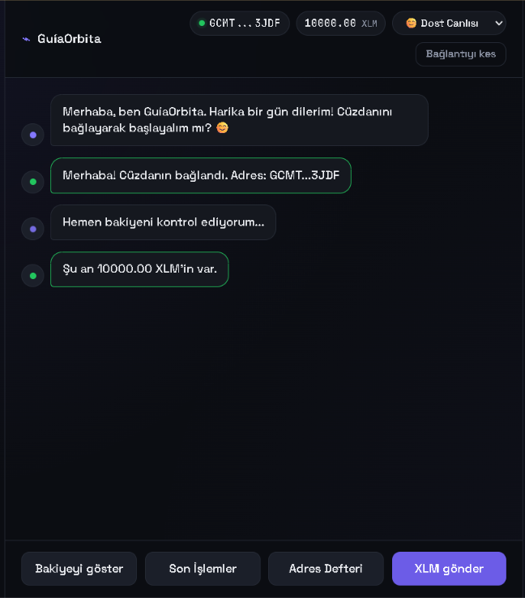
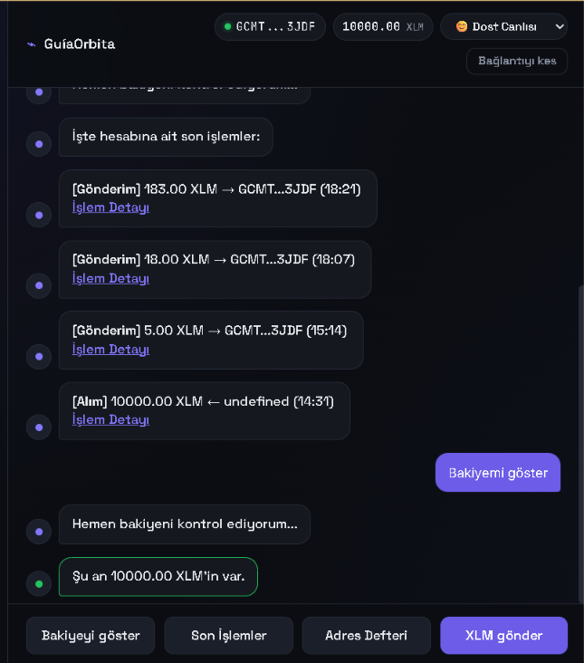
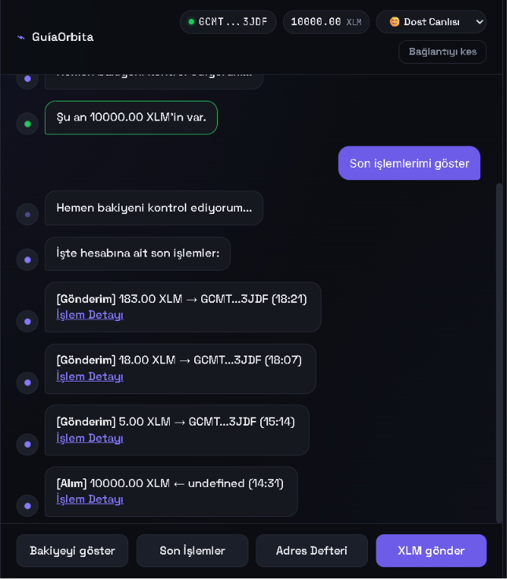
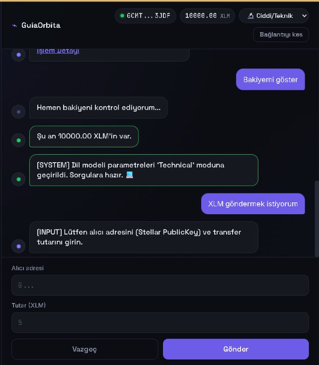
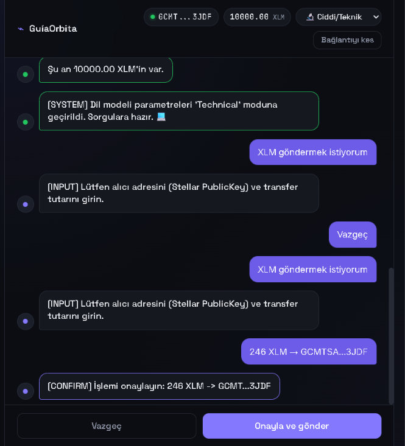
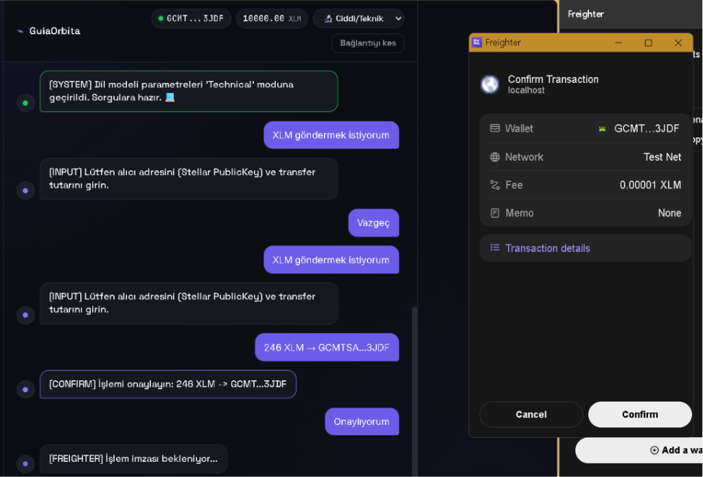
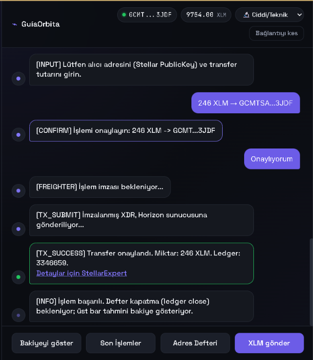
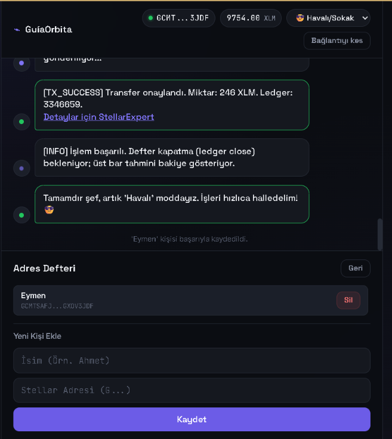

# 🤖 GuíaOrbita (Naber Bot) — Stellar Testnet Chatbot Cüzdan Asistanı

GuíaOrbita, Stellar Testnet üzerinde çalışan, sohbet robotu (chatbot) tarzında etkileşimli bir cüzdan asistanıdır. Geleneksel ve karmaşık paneller yerine, GuíaOrbita blockchain işlemlerini insan odaklı, konuşmaya dayalı bir arayüze dönüştürür. Kullanıcılar Freighter cüzdanlarını bağlayabilir, bakiyelerini kontrol edebilir, işlem geçmişlerini görüntüleyebilir, kişisel rehberlerini yönetebilir ve XLM ödemeleri gönderebilir; tüm bunları bot ile doğal bir sohbet akışı üzerinden gerçekleştirir.

Bu proje, **Stellar Frontend Challenge** seviyesini tamamlamak üzere geliştirilmiştir.

---

## 🌌 Sohbet Tabanlı Cüzdan Deneyimi

Çoğu Web3 arayüzü, kafa karıştırıcı sayılar ve formlarla dolu kuru ve karmaşık panellerden oluşur. GuíaOrbita, kullanıcıları adım adım yönlendiren konuşma tabanlı bir asistan kullanarak bu paradigmayı değiştirir:
- **Rehberli Onboarding**: Bot sizi karşılar, Freighter cüzdan eklentisinin tarayıcınızda kurulu olup olmadığını kontrol eder ve bağlantı kurma sürecinde size rehberlik eder.
- **Bağlamsal Aksiyonlar**: Arayüz sohbete göre dinamik olarak değişir. Statik bir panel göstermek yerine bot, sohbetin durumuna göre (örn. ödeme formu, işlem onayları, adres defteri) alt panelde ilgili butonları ve formları sunar.
- **Proaktif Hata Yönetimi**: Bir şeyler ters gittiğinde bot, karmaşık blockchain hata kodları yerine ne olduğunu anlaşılır bir dille açıklar (örn. Freighter zaman aşımı, yanlış ağ yapılandırması veya yetersiz bakiye).

---

## 🛠️ Teknik Altyapı (Tech Stack)

Uygulama; hız, güvenlik ve geliştirici üretkenliği için tasarlanmış modern ve hafif bir teknoloji yığını kullanır.

| Teknoloji | Kullanım Amacı | Projedeki Rolü / Detayları |
| :--- | :--- | :--- |
| **React 19** | UI Kütüphanesi | Uygulama durumunu (state), arayüz çizimini, bileşen yaşam döngüsünü ve sohbet geçmişi güncellemelerini yönetir. |
| **Vite** | Derleyici & Geliştirici Sunucusu | Hızlı sıcak modül değişimi (HMR) ve optimize edilmiş derleme süreçleri sağlar. |
| **Freighter API** | Güvenli Cüzdan Entegrasyonu | Bağlantı isteklerini ve güvenli işlem imzalamayı yönetmek için tarayıcı cüzdanı (`@stellar/freighter-api`) ile iletişim kurar. |
| **Stellar SDK** | Blockchain İşlemleri | Stellar ağı (`@stellar/stellar-sdk`) ile arayüz oluşturur. Ödemeleri hazırlar, yeni hesaplar oluşturur, hesapları sorgular ve işlemleri Horizon sunucusuna gönderir. |
| **Horizon API** | Stellar Testnet API | Hesap kayıtlarını, bakiye durumlarını ve işlem geçmişlerini halka açık test ağı uç noktalarından çeker. |
| **Vanilla CSS** | Stil Sistemi | Duyarlı (responsive) düzenler ve animasyonlar için özel CSS değişkenleri (token'lar) kullanarak şık bir karanlık tema uygular. |

---

## 📂 Proje Yapısı

Aşağıda, durum yönetimi, React bileşenleri ve Stellar SDK mantığı arasındaki sorumluluk ayrımını gösteren proje dizin ağacı yer almaktadır:

```text
naber-bot/
├── .cursor/                    # IDE editör yapılandırmaları
├── .oxlintrc.json              # Oxlint kod denetim kuralları
├── index.html                  # Ana HTML giriş şablonu
├── package.json                # Proje betikleri ve bağımlılık paketleri
├── package-lock.json           # Bağımlılıklar için tam sürüm kilitleme dosyası
├── vite.config.js              # Vite yapılandırma tanımları
├── PROJECT_STATUS.md           # Proje durumu, çözülen hatalar ve kilometre taşları günlüğü
├── README.md                   # Proje dokümantasyonu (bu dosya)
├── docs/                       # Proje ekran görüntüleri ve dokümantasyon varlıkları
│   ├── wallet-view.png         # Boş Adres Defteri ekran görüntüsü
│   ├── chat-view.png           # Ana cüzdan arayüzü ekran görüntüsü
│   ├── history-view.png        # İşlem geçmişi ekran görüntüsü
│   ├── balance-view.png        # Bakiye kontrolü ekran görüntüsü
│   ├── technical-mode.png      # Teknik mod ekran görüntüsü
│   ├── success-notification.png# Başarılı transfer ekran görüntüsü
│   ├── confirm-modal.png       # Ödeme onaylama ekran görüntüsü
│   ├── address-book-saved.png  # Kayıtlı kişi ve Havalı mod ekran görüntüsü
│   └── freighter-popup.png     # Freighter cüzdan onay ekran görüntüsü
├── public/                     # Statik varlıklar dizini
└── src/                        # Ana React uygulaması kaynak kodları
    ├── main.jsx                # React mount başlangıç noktası
    ├── App.jsx                 # Merkezi uygulama kabuğu, durum makinesi ve iş akışları
    ├── App.css                 # Arayüz stilleri, sohbet balonları, formlar ve animasyonlar
    ├── index.css               # Tipografi, renk değişkenleri ve temel sıfırlama stilleri
    ├── components/             # Yeniden kullanılabilir UI bileşenleri
    │   ├── ActionPanel.jsx     # Dinamik aksiyon alanı (butonlar, ödeme formu, kişiler)
    │   ├── ChatBubble.jsx      # Sohbet balonu (bot, kullanıcı veya sistem bilgisi)
    │   ├── StatusBar.jsx       # Ağ durumu, bakiye ve ayarları içeren üst çubuk
    │   └── TypingIndicator.jsx # Botun yazıyor olduğunu gösteren animasyonlu bileşen
    └── lib/                    # Kütüphane uzantıları ve çekirdek mantık
        ├── stellar.js          # Freighter API ve Horizon Stellar SDK yardımcı fonksiyonları
        └── messages.js         # Ortak konuşma şablonları ve bot kişilik mesajları
```

---

## 🎁 Yeni Geliştirmeler & Özel Özellikler

### 🎭 1. Bot Kişilikleri
Kullanıcılar, Üst Çubuk'taki dropdown menüden botun konuşma tarzını değiştirebilir. Seçilen kişilik `localStorage` üzerinde saklanır ve botun üslubunu anında değiştirir:
*   😊 **Dost Canlısı (Friendly)**: Sıcak, teşvik edici ve nazik bir dil kullanan asistan.
*   🔬 **Ciddi/Teknik (Technical)**: Terminal çıktıları, sistem logları ve teknik terimlerle konuşan asistan.
*   😎 **Havalı/Sokak (Cool)**: Sokak ağzı, kanka hitapları ve rahat bir üslup kullanan asistan.

### 📜 2. Gezgin Entegrasyonlu İşlem Geçmişi
"Son İşlemler" butonu, cüzdanın Horizon üzerindeki son 5 ödeme hareketini çeker ve sohbet ekranında özel kartlar halinde listeler:
*   İşlem yönünü (Giden/Gelen) ayrıştırır.
*   Tutar, alıcı/gönderici adresi ve zaman bilgisini gösterir.
*   Kullanıcının ayrıntıları incelemesi için her işleme tıklanabilir **StellarExpert Gezgin Linki** ekler.

### 📖 3. Yerel Adres Defteri
Kullanıcıların adreslerini kaydetmesini kolaylaştıran entegre rehber yöneticisi:
*   Adresleri isim vererek rehbere kaydedebilme.
*   Rehber verilerini bağlı cüzdana özel olarak `localStorage` ile senkronize etme.
*   İstenilen kişiyi rehberden silebilme.
*   Ödeme Formu'nda yer alan rehber dropdown listesinden kişi seçerek adresi anında otomatik doldurabilme.

---

## 🚀 Kurulum & Yerel Çalıştırma

### Gereksinimler
1.  **Node.js**: [Node.js resmi web sitesinden](https://nodejs.org/) güncel LTS sürümünü yükleyin.
2.  **Freighter Cüzdanı**: Tarayıcınıza [Freighter uzantısını](https://www.freighter.app/) ekleyin.
3.  **Testnet Ayarı**:
    *   Freighter eklentisini açın.
    *   Ayarlar (dişli çark) -> **Preferences** adımlarını takip edin.
    *   **Network** sekmesinden aktif ağı `Public` yerine **Testnet** olarak değiştirin.
    *   Bir hesap oluşturun ya da içe aktarın.

### Çalıştırma Adımları
1.  **Projeyi Klonlayın**: Kod deposunu bilgisayarınıza indirin.
2.  **Proje Klasörüne Gidin**: Terminalde `naber-bot` dizinine geçin:
    ```bash
    cd naber-bot
    ```
3.  **Bağımlılıkları Yükleyin**: Gerekli paketleri indirmek için npm çalıştırın:
    ```bash
    npm install
    ```
4.  **Geliştirici Sunucusunu Başlatın**: Sunucuyu ayağa kaldırın:
    ```bash
    npm run dev
    ```
5.  **Tarayıcıda Açın**: Terminalde gösterilen adresi (genellikle `http://localhost:5173`) tarayıcınızda açarak botu kullanmaya başlayabilirsiniz.

---

## 📸 Ekran Görüntüleri ve Arayüz Galerisi

GuíaOrbita (Naber Bot) uygulamasının tüm özelliklerini ve işlem akışını gösteren ekran görüntüleri galerisi:

### 1. Cüzdan Bağlantısı ve Ana Panel
Freighter bağlandığında, bot bakiyeyi çeker, üst çubuğu günceller ve işlem butonlarını aktif hale getirir:


### 2. Doğal Dilde Bakiye Sorgulama
Mevcut bakiyenizi sorguladığınızda botun verdiği yanıt (Dost canlısı modda):


### 3. Hesap İşlem Geçmişi
"Son İşlemler" tıklandığında cüzdanın son ödeme hareketlerinin listelenmesi ve gezgin linkleri:


### 4. Dinamik Ödeme Girişleri ve Onay Ekranı
Ödeme başlatıldığında arayüzün "Ciddi/Teknik" moda geçişi, form ekranı ve onay adımı:



### 5. Güvenli Freighter Cüzdan İmza Penceresi
Transfer işlemi gönderildiğinde Freighter cüzdanının işlem detaylarıyla birlikte ekranda belirmesi:


### 6. İyimser Önbellek ve Başarılı İşlem Bildirimi
İşlem ağda onaylandığında botun Ledger ID'sini ve gezgin linkini sunması. İyimser önbellekleme sayesinde bakiye anında `9754.00 XLM` olarak güncellenir:


### 7. Özel Adres Defteri ve Havalı Mod
Adres defterine "Eymen" kişisinin başarıyla kaydedilmesi ve "Havalı/Sokak" modunun etkinleştirilmesi:

